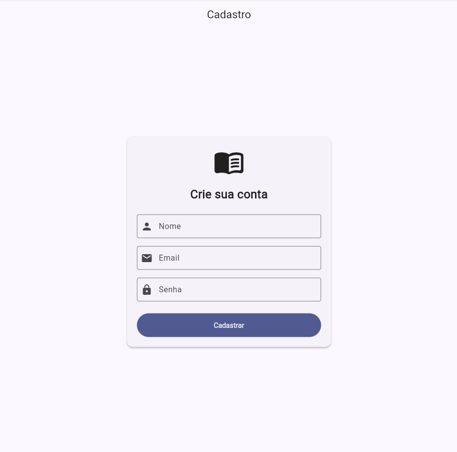
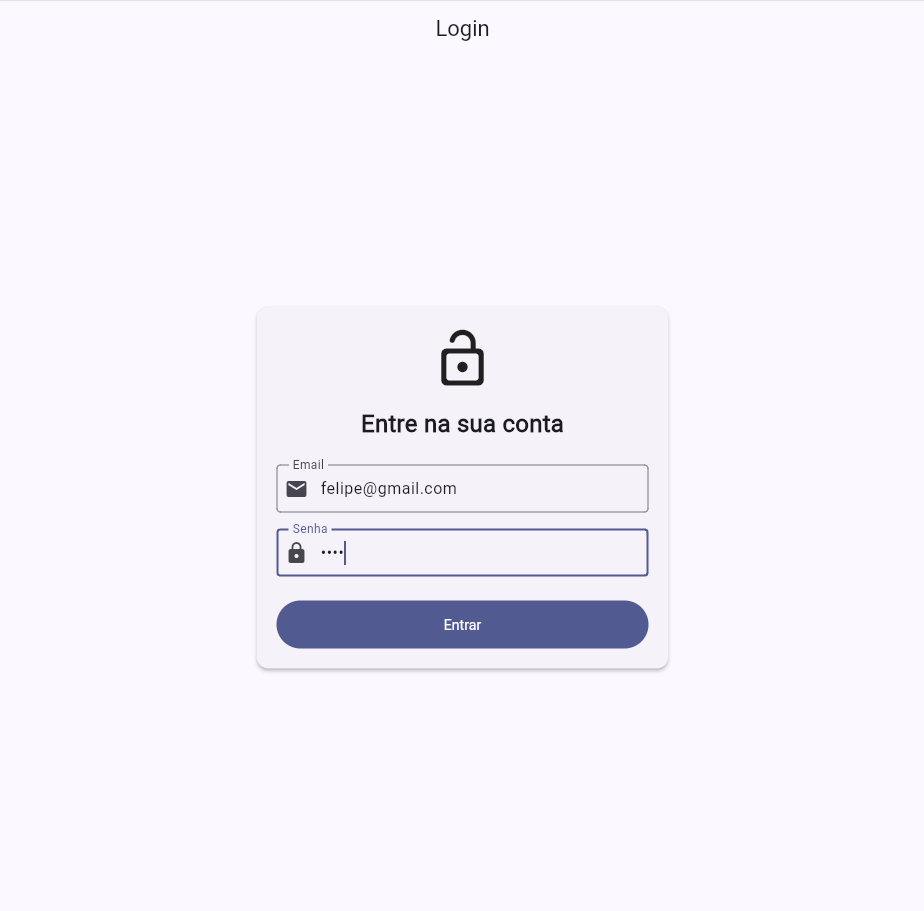
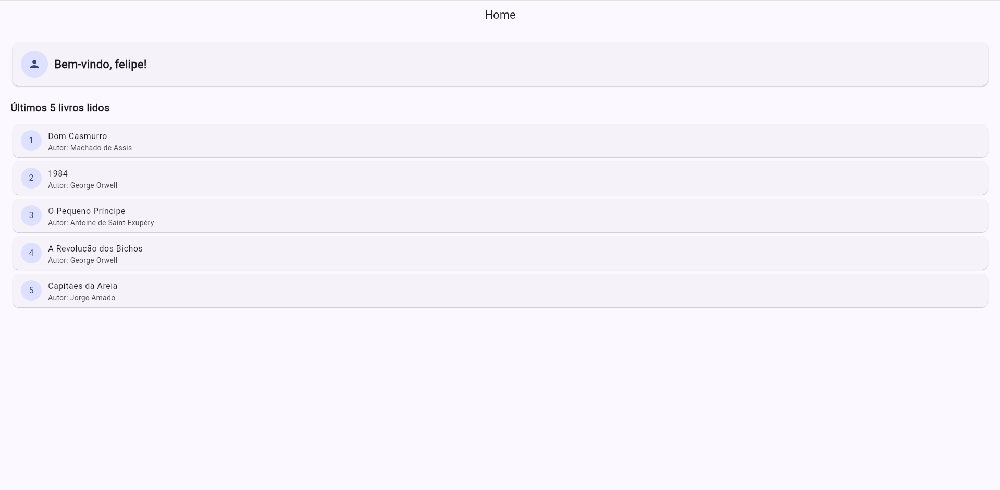

# Controle de Leitura

## Descrição do aplicativo e seu objetivo
Este projeto foi desenvolvido em Flutter com o objetivo de simular um aplicativo mobile de controle de leitura. O sistema permite que o usuário realize um cadastro, faça um login fictício e visualize os últimos 5 livros lidos.

A proposta da atividade é aplicar, na prática, os conceitos estudados em aula, incluindo Dart, widgets, gerenciamento de estado, navegação entre telas e organização do projeto. O aplicativo não utiliza backend nem banco de dados.

## Funcionalidades implementadas
- Cadastro de usuário com os campos nome, e-mail e senha
- Validação simples dos campos de cadastro
- Navegação para a tela de login após o cadastro
- Login fictício com validação dos dados informados
- Navegação para a tela Home em caso de sucesso
- Exibição de mensagem de boas-vindas com o nome do usuário
- Lista com os últimos 5 livros lidos
- Bloqueio do retorno para a tela de login após entrar no sistema

---

## Informações para preencher
- **Aluno:** Felipe Fernando Corrêa
- **Disciplina:** Desenvolvimento mobile
- **Professor:** Gabriel Caixeta Silva
- **Data de entrega:** 01/04/2026
- **Link do repositório:** https://github.com/FelipeFernando04/prova_flutter/
- **Turma:** ADS 5° fase

---

## Descrição das telas

### Tela de Cadastro
A tela de cadastro possui os campos Nome, E-mail e Senha, além do botão **Cadastrar**. Nela é feita uma validação simples para garantir que os dados foram preenchidos corretamente. Após o cadastro, o usuário é encaminhado para a tela de login.



### Tela de Login
A tela de login possui os campos E-mail e Senha, além do botão **Entrar**. Os dados digitados são comparados com os dados cadastrados anteriormente. Quando a validação é bem-sucedida, o usuário é direcionado para a tela Home.



### Tela Home
A tela Home exibe uma mensagem de boas-vindas com o nome do usuário e apresenta a lista dos últimos 5 livros lidos, contendo título e autor. Após o login, não é permitido voltar para a tela anterior.



## Conceitos utilizados
- Flutter
- Dart
- Widgets
- StatefulWidget
- StatelessWidget
- Navigator
- setState
- MaterialApp
- Scaffold
- TextFormField
- Form
- ListView.builder
- Organização de arquivos em pastas

## Instruções para executar o projeto localmente

### Pré-requisitos
- Flutter instalado
- Dart instalado
- VS Code ou Android Studio
- Emulador, navegador ou dispositivo físico para testes

### Passo a passo
1. Clone o repositório:
```bash id="01mfwj"
git clone https://github.com/FelipeFernando04/prova_flutter/
